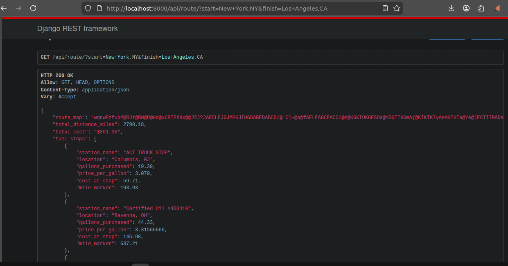

# Fuel Routing Optimization API

A robust Django REST API designed to calculate the optimal driving route between two locations within the USA and determine the most cost-effective fuel stops. The system assumes a vehicle with a 500-mile maximum range and a fuel efficiency of 10 miles per gallon (MPG).

## Features
* **Optimal Routing:** Integrates with the Open Source Routing Machine (OSRM) API to generate accurate driving routes.
* **Cost-Effective Fueling:** Utilizes a greedy optimization algorithm to find the absolute cheapest fuel stops along the route without running out of gas.
* **Pre-processed Spatial Data:** Geocodes CSV fuel station data into an SQLite database via a custom management command to ensure lightning-fast API response times and avoid third-party rate limits during runtime.
* **Polyline Map Generation:** Returns an encoded polyline map string for easy frontend rendering.

---

## Prerequisites
* Python 3.10+ (Required for the latest stable Django versions)
* pip (Python package installer)

## Local Setup & Installation

**1. Clone the repository**
```bash
git clone [https://github.com/syntaxland/fuel-routing-optimization-api.git](https://github.com/syntaxland/fuel-routing-optimization-api.git)
cd fuel-routing-optimization-api

```

**2. Create and activate a virtual environment**

```bash
# Windows
python -m venv venv
venv\Scripts\activate

# macOS/Linux
python3 -m venv venv
source venv/bin/activate

```

**3. Install dependencies**

```bash
pip install -r requirements.txt

```

**4. Run database migrations**

```bash
python manage.py migrate

```

**5. Ingest and Geocode Fuel Station Data**
*Note: A `db.sqlite3` file is already included in the repo to save you time. If you want to rebuild the database from the provided `fuel-prices-for-be-assessment.csv`, run the following custom management command. This parses the CSV and geocodes the addresses using Nominatim.*

```bash
python manage.py load_stations

```

**6. Start the development server**

```bash
python manage.py runserver

```

**7. Run Test**

```bash
python manage.py test api

```

---

## API Endpoint Documentation

### Get Optimal Route

Retrieves the route geometry, total distance, optimal fuel stops, and total fuel cost.

**Endpoint:** `GET /api/route/`

**Query Parameters:**

* `start` (string, required): The starting location (e.g., "New York, NY").
* `finish` (string, required): The destination location (e.g., "Los Angeles, CA").

**Example Request:**

```http
GET http://localhost:8000/api/route/?start=New+York,NY&finish=Los+Angeles,CA

```

**Example Response (200 OK):**

```json
{
    "route_map": "wqnwFzfubM@BJt@BN@D@Hd@xCBTFXNx... [encoded polyline string for map rendering] ...",
    "total_distance_miles": 2798.18,
    "total_cost": "$801.36",
    "fuel_stops": [
        {
            "station_name": "ACI TRUCK STOP",
            "location": "Columbia, NJ",
            "gallons_purchased": 19.39,
            "price_per_gallon": 3.079,
            "cost_at_stop": 59.71,
            "mile_marker": 193.93
        },
        {
            "station_name": "Certified Oil #400410",
            "location": "Ravenna, OH",
            "gallons_purchased": 44.33,
            "price_per_gallon": 3.31566666,
            "cost_at_stop": 146.98,
            "mile_marker": 637.21
        },
        {
            "station_name": "SAPP BROS TRAVEL CENTER",
            "location": "Peru, IL",
            "gallons_purchased": 38.79,
            "price_per_gallon": 3.389,
            "cost_at_stop": 131.45,
            "mile_marker": 1025.07
        },
        {
            "station_name": "KUM & GO #4110",
            "location": "Des Moines, IA",
            "gallons_purchased": 22.16,
            "price_per_gallon": 3.02733333,
            "cost_at_stop": 67.1,
            "mile_marker": 1246.71
        },
        {
            "station_name": "CUBBYS #2101",
            "location": "Gothenburg, NE",
            "gallons_purchased": 27.7,
            "price_per_gallon": 3.13233333,
            "cost_at_stop": 86.78,
            "mile_marker": 1523.76
        },
        {
            "station_name": "CIRCLE K #2744095",
            "location": "Denver, CO",
            "gallons_purchased": 16.62,
            "price_per_gallon": 3.299,
            "cost_at_stop": 54.84,
            "mile_marker": 1689.99
        },
        {
            "station_name": "DOWNIEVILLE FUEL STOP",
            "location": "Dumont, CO",
            "gallons_purchased": 5.54,
            "price_per_gallon": 3.459,
            "cost_at_stop": 19.17,
            "mile_marker": 1745.4
        },
        {
            "station_name": "TA EXPRESS #6264",
            "location": "Grand Junction, CO",
            "gallons_purchased": 41.56,
            "price_per_gallon": 4.049,
            "cost_at_stop": 168.26,
            "mile_marker": 2160.97
        },
        {
            "station_name": "SCENIC QUIK STOP",
            "location": "Salina, UT",
            "gallons_purchased": 19.39,
            "price_per_gallon": 3.459,
            "cost_at_stop": 67.08,
            "mile_marker": 2354.9
        }
    ]
}

```

### Response Breakdown

* **`route_map`**: A compressed geographic polyline string. Frontend mapping libraries (like Leaflet or Google Maps) decode this to draw the exact driving route on a map.
* **`total_distance_miles`**: The total driving distance from the start to the finish location.
* **`total_cost`**: The absolute lowest possible cost to fuel the vehicle for the entire trip, calculated using a greedy optimization algorithm.
* **`fuel_stops`**: A step-by-step array of the most cost-effective stations to stop at along the route, detailing exactly how many gallons to purchase to reach the next optimal station without exceeding the 500-mile tank capacity.

---

## Algorithmic Approach & Architecture

To meet the requirement of minimizing third-party API calls while maintaining high performance, this project utilizes the following architecture:

1. **Data Pre-processing:** Live geocoding 1000+ CSV rows per request is highly inefficient and prone to rate limits. The `load_stations` management command handles this asynchronously, caching the latitude/longitude data directly into the database.
2. **Single Routing Call:** The API makes exactly *one* call to the OSRM routing engine to fetch the trip's geometry.
3. **Spatial Filtering:** The OSRM polyline is decoded into a coordinate list. A spatial filter using the Haversine formula is applied to find fuel stations that fall within a tight radius of the route path, ensuring the vehicle does not deviate significantly from the highway.
4. **Greedy Fuel Optimization:** * The algorithm tracks the vehicle's position along the route.
* At any point, it looks ahead to all reachable stations within the 500-mile tank range.
* If a station ahead is *cheaper* than the current best option, the vehicle only buys enough fuel to reach that cheaper station.
* If no cheaper stations are within range, the vehicle fills the tank completely and proceeds to the most cost-effective reachable station.


---

## Project Structure

The project follows the "Fat Models, Helper Services, Thin Views" design pattern to separate business logic from the HTTP layer.

```text
fuel-routing-optimization-api/
│
├── manage.py
├── requirements.txt
├── README.md
├── fuel-prices-for-be-assessment.csv    # The raw data file provided for the assessment
├── db.sqlite3                           # Pre-populated database with geocoded coordinates
│
├── core/                                # Main Django project configuration
│   ├── settings.py                      
│   ├── urls.py                          # Root URL routing
│   └── wsgi.py / asgi.py
│
└── api/                                 # Main application handling the routing API
    ├── models.py                        # FuelStation data model
    ├── urls.py                          # Endpoint mapping (/api/route/)
    ├── views.py                         # HTTP request/response handling (OptimalRouteView)
    ├── services.py                      # CORE LOGIC: OSRM API integration & Greedy Algorithm
    ├── tests.py                         # Unit tests for spatial math and API validation
    │
    └── management/
        └── commands/
            └── load_stations.py         # Data ingestion and geocoding script

```

---



